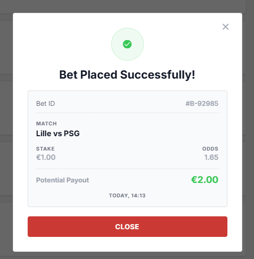
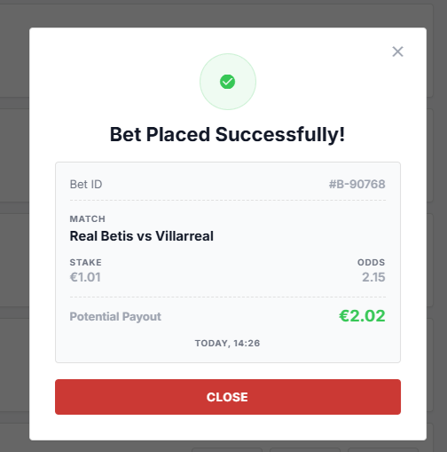
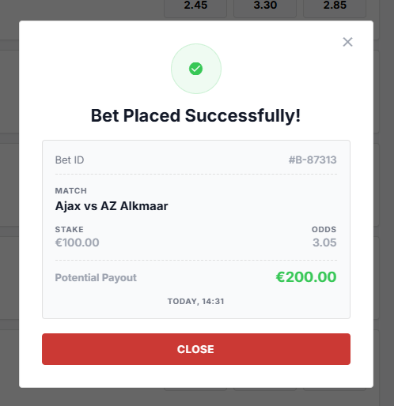
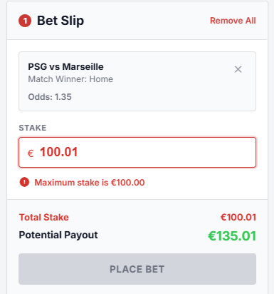
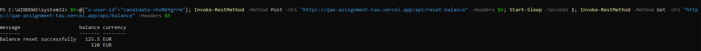
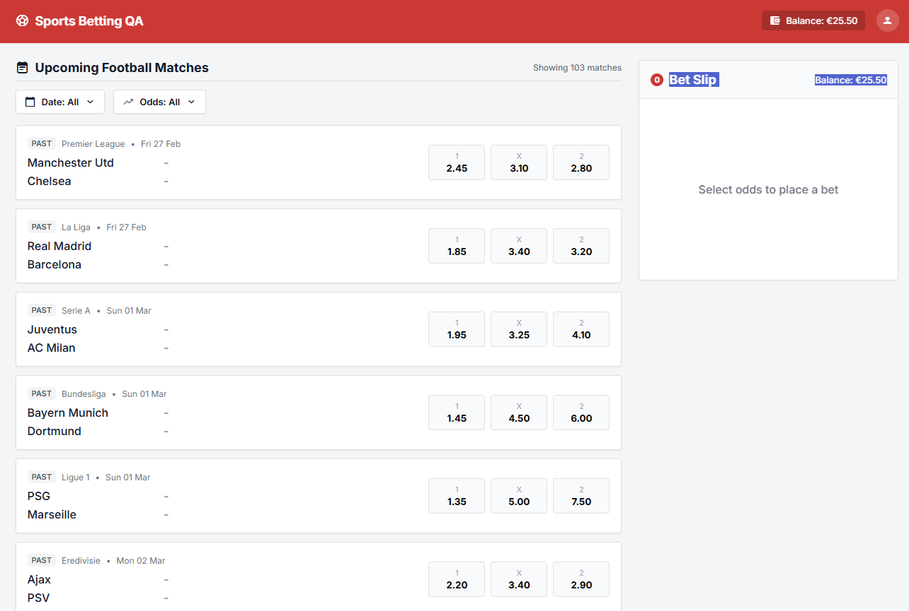
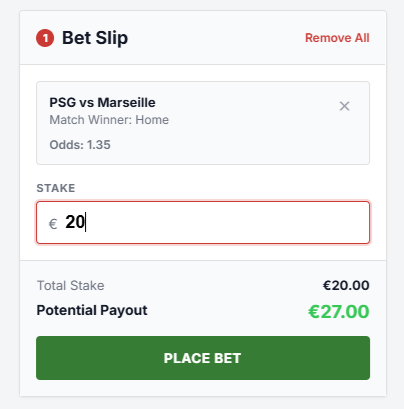
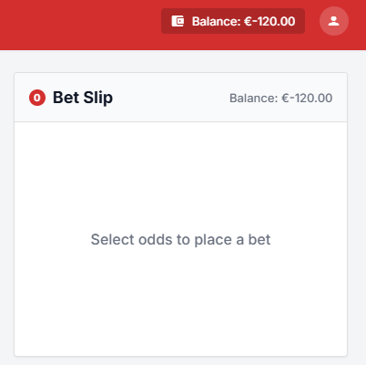

# Execution Results and Bug Reports

## 1. Test Execution Information

| Field | Value |
|---|---|
| Status | Manual execution completed for the selected top-three scenarios |
| Tester | Tamás |
| Execution date | `2026-07-13` to `2026-07-14` |
| Environment | Latest desktop Chrome on Windows; Windows PowerShell for API checks |
| Application URL | `https://qae-assignment-tau.vercel.app/?user-id=candidate-vhoRbYgrrm` |
| User ID | `candidate-vhoRbYgrrm` |
| Test plan reference | `test_plan.md` |
| Evidence folder | `../evidence/` |

## 2. Execution Summary

| Test Case ID | Title | Priority | Result | Defects / Clarifications |
|---|---|---:|---|---|
| TP-01 | Successful single-bet placement with financial and receipt consistency | Critical | **Blocked** | BUG-001 |
| TP-02 | Stake exceeding available balance is rejected without financial state change | High | **Pass** | BUG-003 observed during setup |
| TP-03 | Stake boundary and input-format validation | High | **Failed** | BUG-004, BUG-005, BUG-006, BUG-007; CLAR-001, CLAR-002 |

| Metric | Value |
|---|---:|
| Selected scenarios | 3 |
| Completed | 3 |
| Passed | 1 |
| Failed | 1 |
| Blocked | 1 |
| Confirmed defects | **8** |
| Critical defects | **3** |
| High defects | **4** |
| Medium defects | **1** |
| Open specification clarifications | **2** |

### Overall Assessment

The core balance reset precondition is unreliable, which blocked deterministic execution of TP-01. The isolated insufficient-balance check worked correctly in TP-02, but follow-up exploratory testing showed that repeated placements can bypass the available-balance rule and drive the persisted account balance below zero. Successful placements also exposed multiple receipt and state-consistency defects, including a critical payout error. Based on these financial-integrity issues, the build should not be considered release-ready without investigation and correction of BUG-001, BUG-005, and BUG-008.

---

# 3. Test Run Records

## TP-01 — Successful single-bet placement with financial and receipt consistency

| Field | Value |
|---|---|
| Result | **Blocked** |
| Expected starting balance | **€125.50 EUR** |
| Reset response | **€125.50 EUR** |
| Persisted API balance | **€120.00 EUR** |
| UI balance | **€120.00 EUR**, including after hard refresh |
| Reproducibility | **3/3** |
| Defect | BUG-001 |

### Step Results

| Step | Expected Result | Actual Result | Status | Evidence |
|---:|---|---|---|---|
| Setup | `POST /api/reset-balance` returns and persists **€125.50 EUR**. | POST returned **€125.50 EUR**, but immediate `GET /api/balance` returned **€120.00 EUR**. | **Fail** | `../evidence/BUG-001-reset-balance-inconsistency.png` |
| 1 | UI displays the persisted reset balance of **€125.50**. | UI displayed **€120.00**, including after refresh. | **Fail** | Same evidence and user observation |
| 2–6 | Execute the successful E2E flow from the specified deterministic baseline. | Suspended because the required financial precondition and balance oracle were unreliable. | **Blocked** | BUG-001 |

### Risk-Based Execution Decision

Execution was stopped for TP-01 because the configured starting balance could not be established reliably. Continuing the scenario under a different balance would no longer validate the exact planned oracle and could obscure additional balance defects. The remaining time was redirected to independent high-risk controls and boundary testing.

---

## TP-02 — Stake exceeding available balance is rejected without financial state change

| Field | Value |
|---|---|
| Result | **Pass** |
| Starting persisted balance | **€120.00 EUR** due to BUG-001 |
| Setup bet | Valid API bet: stake **€94.50**, odds **1.65** |
| Balance after setup bet | **€25.50 EUR** |
| Stake under test | **€25.51** |
| Related defect observed during setup | BUG-003 |

### Step Results

| Step | Expected Result | Actual Result | Status | Evidence |
|---:|---|---|---|---|
| 1 | UI displays the known remaining balance. | UI displayed **€25.50** after refresh. | **Pass** | User observation |
| 2 | A single future outcome is selected. | A future PSG vs Lille outcome was selected. | **Pass** | User observation |
| 3 | Entering **€25.51** is rejected because it exceeds the available balance. | UI showed **`Insufficient balance`** and **Place Bet** remained inactive. | **Pass** | `../evidence/TP-02-insufficient-balance-validation.png` |
| 4 | Persisted balance remains unchanged. | `GET /api/balance` remained **€25.50 EUR**. | **Pass** | User/API observation |

### Additional Observation

The valid API setup bet returned `currency: USD` although the documented account currency and the balance endpoint use EUR. This is reported separately as BUG-003.

---

## TP-03 — Stake boundary and input-format validation

| Field | Value |
|---|---|
| Result | **Failed** |
| Validation assessment | Most stake-input controls behaved correctly |
| Failure reason | Successful datasets exposed confirmed receipt and balance-consistency defects |
| Defects | BUG-004, BUG-005, BUG-006, BUG-007 |
| Clarifications | CLAR-001, CLAR-002 |

### Dataset Results

| Dataset | Input | Expected classification | Actual Result | Validation Verdict | Additional Findings |
|---:|---:|---|---|---|---|
| 1 | Empty | Invalid — required | Field remained empty and **Place Bet** was inactive. | **Pass** | No explicit message required by the specification. |
| 2 | `0.99` | Invalid — below minimum | Displayed **`Minimum stake is €1.00`**; button inactive. | **Pass** | Preview showed €1.63 for `0.99 × 1.65 = 1.6335`; recorded under CLAR-002. |
| 3 | `1.00` | Specification conflict | Accepted and placed successfully. | **Clarification Required** | Receipt defects BUG-004, BUG-005, BUG-006; stale balance BUG-007. |
| 4 | `1.01` | Valid lower value | Accepted and placed successfully. | **Pass** | Receipt defects BUG-004, BUG-005, BUG-006; stale balance BUG-007. |
| 5 | `100.00` | Valid upper boundary | Accepted and placed successfully. | **Pass** | Receipt displayed €200.00 instead of €305.00; BUG-004, BUG-005, BUG-006, BUG-007 reproduced. |
| 6 | `100.01` | Invalid — above maximum | With verified balance **€120.00**, displayed **`Maximum stake is €100.00`**; button inactive. | **Pass** | Isolated from insufficient-balance validation. |
| 7 | `10.001` | Invalid — precision | Third decimal digit was not accepted; retained value was **10.00**, for which the button became active. | **Pass** | UI enforces maximum two-decimal precision at input level. |
| 8 | `abc` | Invalid — non-numeric | Alphabetic characters were rejected; field stayed empty and button inactive. | **Pass** | UI enforces numeric input at field level. |

### Evidence









---

# 4. Quick Exploratory Checks

| Check | Observation | Outcome |
|---|---|---|
| Temporal validity of the match catalogue | `GET /api/matches` returned 103 records, including numerous dates before the execution date (`2026-07-13`). The UI displayed entries marked **PAST** under **Upcoming Football Matches**. | BUG-002 |
| API response contract after a successful bet | The response returned the correct stake, odds, payout and new balance, but reported `currency: USD` instead of EUR. | BUG-003 |
| Pre-placement versus receipt payout | The bet slip calculated payout correctly before placement, but the success receipt used an incorrect value. | BUG-005 |
| Receipt consistency across multiple successful stakes | Team order was reversed, selected outcome was omitted, and payout was incorrect in repeated successful placements. | BUG-004, BUG-005, BUG-006 |
| UI balance refresh after successful placement | The displayed balance remained stale after closing the receipt and corrected only after a page refresh. | BUG-007 |
| Repeated placement against stale balance | Additional bets were accepted without revalidating the latest persisted funds. Repeating the flow drove the account below zero; after refresh, the UI displayed **€-120.00**. | BUG-008 |

---

# 5. Bug Reports

## BUG-001 — Reset balance response does not match persisted balance

| Field | Value |
|---|---|
| Severity | **Critical** |
| Release impact | **Release blocker candidate** |
| Defect type | API / persisted financial-state consistency |
| Found during | TP-01 setup |
| Reproducibility | **3/3** |
| Affected components | `POST /api/reset-balance`, persisted balance, `GET /api/balance`, UI balance |
| Requirement | Reset response and persisted state must be consistent |
| Evidence | `../evidence/BUG-001-reset-balance-inconsistency.png` |
| HTTP status | Not captured; PowerShell returned a successful response object |

### Preconditions

- Use header `x-user-id: candidate-vhoRbYgrrm`.
- No specific prior balance should be required by the reset contract.

### Reproduction Steps

1. Open Windows PowerShell.
2. Execute:

```powershell
$h=@{"x-user-id"="candidate-vhoRbYgrrm"}; Invoke-RestMethod -Method Post -Uri "https://qae-assignment-tau.vercel.app/api/reset-balance" -Headers $h; Start-Sleep -Seconds 1; Invoke-RestMethod -Method Get -Uri "https://qae-assignment-tau.vercel.app/api/balance" -Headers $h
```

3. Compare the reset response with the immediately persisted balance.
4. Open or refresh the web application using the same user ID.
5. Compare the UI balance with both API values.

| Expected | Actual |
|---|---|
| Reset response, persisted balance and UI all show **€125.50 EUR**. | Reset response shows **€125.50 EUR**, while `GET /api/balance` and the UI show **€120.00 EUR**. |

### Business Impact

The API confirms a financial reset that is not reflected in persisted state. This makes account information unreliable, prevents deterministic testing, and could create incorrect downstream calculations or customer-facing balance disputes.

### Evidence



---

## BUG-002 — Past matches are returned and displayed as upcoming events

| Field | Value |
|---|---|
| Severity | **High** |
| Defect type | API data integrity / UI catalogue filtering |
| Found during | Quick exploratory check |
| Reproducibility | **1/1** |
| Affected components | `GET /api/matches`, Upcoming Football Matches UI |
| Requirement | Only upcoming/pre-match events should be available |
| Evidence | `../evidence/BUG-002-api-returns-past-matches.txt`; `../evidence/BUG-002-ui-shows-past-events-under-upcoming.png` |

### Preconditions

- Execution date: `2026-07-13`.
- Use the assigned candidate user ID.

### Reproduction Steps

1. Call `GET /api/matches` with the required `x-user-id` header.
2. Inspect returned `kickoffDate` values.
3. Open the web application.
4. Review the list under **Upcoming Football Matches**.
5. Compare displayed event dates/statuses with the execution date.

| Expected | Actual |
|---|---|
| The API and UI expose only upcoming/pre-match events. | The API returned 103 matches including numerous events dated before `2026-07-13`; the UI also displayed entries marked **PAST** under **Upcoming Football Matches**. |

### Business Impact

Users may see or attempt to interact with expired betting events. This misrepresents market availability, undermines trust, and may lead to invalid bet-placement attempts.

### Evidence



---

## BUG-003 — Successful place-bet response returns USD instead of EUR

| Field | Value |
|---|---|
| Severity | **High** |
| Defect type | API response contract / currency consistency |
| Found during | TP-02 setup |
| Reproducibility | **1/1** |
| Affected component | `POST /api/place-bet` |
| Requirement | Account and betting values are denominated in EUR |
| Evidence | `../evidence/BUG-003-place-bet-returns-wrong-currency.txt` |

### Preconditions

- Persisted balance: **€120.00 EUR**.
- Valid future match ID: `ligue-1-psg-lille-2026-07-16`.
- Valid selection: `HOME`.
- Valid stake: `94.50`.

### Reproduction Steps

1. Send a valid `POST /api/place-bet` request with the assigned `x-user-id`.
2. Use the match, selection and stake listed above.
3. Inspect the successful response body.
4. Compare the `currency` field with the account currency returned by the balance endpoint and displayed by the UI.

| Expected | Actual |
|---|---|
| Successful response reports `currency: EUR`. | Successful response reports `currency: USD`, while balance and UI values are denominated in EUR. |

### Observed Response

```text
message   : Bet placed successfully
matchId   : ligue-1-psg-lille-2026-07-16
selection : HOME
stake     : 94.5
odds      : 1.65
payout    : 155.92
balance   : 25.5
currency  : USD
```

### Business Impact

A currency mismatch in a successful financial transaction response can lead to incorrect client rendering, reporting, integrations, audit records, and customer disputes.

---

## BUG-004 — Success receipt reverses the documented match order

| Field | Value |
|---|---|
| Severity | **High** |
| Defect type | UI receipt data mapping |
| Found during | TP-03 successful datasets |
| Reproducibility | **3/3** based on recorded execution observations |
| Affected component | Success receipt |
| Requirement | Receipt must preserve the original home/away match order |
| Evidence | `../evidence/TP-03-EUR-1-00-success-receipt.png`; `../evidence/TP-03-EUR-1-01-success-receipt.png`; `../evidence/TP-03-EUR-100-00-success-receipt.png` |

### Reproduction Steps

1. Select an outcome for a future match and record the displayed home/away order.
2. Enter a valid stake.
3. Place the bet successfully.
4. Compare the match order in the success receipt with the source match card/bet slip.
5. Repeat with other future matches and stakes.

| Expected | Actual |
|---|---|
| Receipt displays the match in the same home/away order as the source event. | Receipt displays the teams in reversed order. Examples include source **PSG vs Lille** becoming **Lille vs PSG**, and source **Villarreal vs Real Betis** becoming **Real Betis vs Villarreal**. The issue was observed again in the €100.00 run. |

### Business Impact

Reversing team order can mislead the customer about the event associated with the wager, especially when the selected market is HOME or AWAY. It increases dispute and support risk.

---

## BUG-005 — Success receipt displays an incorrect potential payout

| Field | Value |
|---|---|
| Severity | **Critical** |
| Release impact | **Release blocker candidate** |
| Defect type | Financial calculation / receipt data mapping |
| Found during | TP-03 successful datasets |
| Reproducibility | **3/3** |
| Affected component | Success receipt |
| Requirement | Potential payout must equal `stake × odds` |
| Evidence | `../evidence/BUG-005-pre-placement-payout-correct.png`; `../evidence/TP-03-EUR-1-00-success-receipt.png`; `../evidence/TP-03-EUR-1-01-success-receipt.png`; `../evidence/TP-03-EUR-100-00-success-receipt.png` |

### Reproduction Steps

1. Select a future match outcome and record its odds.
2. Enter a valid stake.
3. Verify the potential payout in the bet slip before placement.
4. Place the bet successfully.
5. Compare the success receipt payout with `stake × odds`.
6. Repeat with different stakes and odds.

### Observed Runs

| Run | Stake | Odds | Expected Formula Result | Receipt |
|---:|---:|---:|---:|---:|
| 1 | €1.00 | 1.65 | €1.65 | **€2.00** |
| 2 | €1.01 | 2.15 | €2.1715 before display rounding | **€2.02** |
| 3 | €100.00 | 3.05 | €305.00 | **€200.00** |

The receipt value equalled exactly **2 × stake** in all three runs, regardless of odds.

### Defect Localisation

The bet slip calculated the payout correctly before placement. For example, it displayed **€27.00** for **€20.00 × 1.35**. The incorrect value appeared only in the success receipt. This indicates a receipt-side calculation or mapping problem; the exact technical root cause has not been proven.

| Expected | Actual |
|---|---|
| Receipt payout matches the documented formula and the correct pre-placement value. | Receipt payout is incorrect and appears to use `stake × 2` rather than the selected odds. |

### Business Impact

This is a direct financial-integrity defect. It can misstate the customer's expected return, create settlement disputes, expose the company to financial and regulatory risk, and invalidate transaction records.

### Evidence



---

## BUG-006 — Success receipt does not show the selected outcome

| Field | Value |
|---|---|
| Severity | **Medium** |
| Defect type | Missing required receipt information |
| Found during | TP-03 successful datasets |
| Reproducibility | **3/3** |
| Affected component | Success receipt |
| Requirement | Receipt must show the selected outcome |
| Evidence | `../evidence/TP-03-EUR-1-00-success-receipt.png`; `../evidence/TP-03-EUR-1-01-success-receipt.png`; `../evidence/TP-03-EUR-100-00-success-receipt.png` |

### Reproduction Steps

1. Select a documented outcome such as HOME, DRAW or AWAY.
2. Enter a valid stake and place the bet.
3. Inspect all fields in the success receipt.
4. Repeat with additional outcomes or matches.

| Expected | Actual |
|---|---|
| Receipt explicitly displays the selected outcome. | Receipt displays Bet ID, match, stake, odds, payout and timestamp, but does not display the selected outcome. |

### Business Impact

The customer cannot verify which outcome was actually recorded. Combined with reversed team order, this materially increases ambiguity and dispute risk.

---

## BUG-007 — UI balance remains stale after closing a successful receipt

| Field | Value |
|---|---|
| Severity | **High** |
| Defect type | UI state synchronisation / financial display |
| Found during | TP-03 successful datasets |
| Reproducibility | **3/3** |
| Affected components | Success modal close flow, account balance display |
| Requirement | Successful placement must deduct stake exactly once and display the updated balance consistently |
| Evidence | User-observed before/after values recorded during execution |

### Reproduction Steps

1. Record the current displayed balance.
2. Place a valid bet successfully.
3. Close the success receipt.
4. Observe the balance without refreshing the page.
5. Refresh the page.
6. Compare the pre-close, post-close and post-refresh values.
7. Repeat with other valid stakes.

### Observed Runs

| Run | Starting Balance | Stake | Immediately After Closing Receipt | After Refresh |
|---:|---:|---:|---:|---:|
| 1 | €25.50 | €1.00 | **€25.50** | €24.50 |
| 2 | €24.50 | €1.01 | **€24.50** | €23.49 |
| 3 | €120.00 | €100.00 | **€120.00** | €20.00 |

| Expected | Actual |
|---|---|
| UI immediately displays the new balance after the successful transaction and receipt close. | UI continues to display the old balance until a page refresh, after which the persisted balance is shown correctly. |

### Business Impact

The customer may believe funds were not deducted and attempt additional actions based on an incorrect visible balance. This creates confusion, duplicate-action risk, and loss of trust in account information.

---

## BUG-008 — Repeated bets are accepted beyond the available balance and create a negative account balance

| Field | Value |
|---|---|
| Severity | **Critical** |
| Release impact | **Release blocker** |
| Defect type | API / business-rule enforcement / persisted financial-state integrity |
| Found during | Quick exploratory testing following BUG-007 |
| Reproducibility | **1/1 exploratory sequence** |
| Affected components | Repeated bet placement, available-balance validation, persisted account balance |
| Requirement | A stake must not exceed the current available balance; insufficient-balance placement must be blocked or rejected |
| Evidence | `../evidence/BUG-008-negative-balance-after-repeated-bets.png` |
| HTTP status | Not captured during this exploratory sequence |

### Preconditions

- Start with a positive persisted balance.
- Use the same authenticated test user for all placements.
- Complete one successful bet and close the receipt without refreshing the page, reproducing the stale displayed balance from BUG-007.

### Reproduction Steps

1. Place a valid bet and close the success receipt without refreshing the page.
2. Confirm that the UI still displays the pre-bet balance.
3. Select another available outcome.
4. Enter and place a stake that appears affordable according to the stale UI balance but exceeds the actual remaining persisted balance.
5. Repeat the placement flow without refreshing the page.
6. Refresh the application or query `GET /api/balance`.
7. Inspect the resulting persisted balance.

| Expected | Actual |
|---|---|
| Every placement revalidates the stake against the latest persisted balance. A stake above the current available funds is rejected, and the balance can never fall below **€0.00**. | Repeated bets were accepted while the displayed balance remained unchanged. After refresh, the persisted balance was rendered as **€-120.00**. |

### Business Impact

This is a direct financial-control failure. A customer can continue placing wagers without sufficient funds, creating unlimited credit exposure, negative account balances, settlement and reconciliation errors, financial loss, customer disputes, and potential regulatory or audit consequences.

### Evidence



### Evidence Limitation

The screenshot confirms the persisted negative balance after refresh. Individual request and response payloads were not captured during this exploratory sequence, so the exact failing validation layer should be confirmed through API logs or a focused reproduction with network capture.

---

# 6. Specification Clarification Log

| ID | Area | Specification Issue | Observed Behaviour | Test Assessment |
|---|---|---|---|---|
| CLAR-001 | Minimum stake | Business Rules define **€1.00**; Stake Validation defines **€1.01**; required UI message says **`Minimum stake is €1.00`**. | Exactly **€1.00** was accepted and placed successfully. | Record behaviour but do not mark the boundary itself Pass/Fail until clarified. |
| CLAR-002 | Payout rounding | Formula is specified, but display precision and rounding mode are not. | Examples: `94.50 × 1.65 = 155.925 → 155.92`; `25.51 × 1.65 = 42.0915 → 42.09`; `0.99 × 1.65 = 1.6335 → 1.63`; `100.01 × 1.35 = 135.0135 → 135.01`. | Record observed behaviour without a defect verdict until rounding rules are defined. This clarification does not affect BUG-005, whose receipt values are materially incorrect rather than normal rounding differences. |

---

# 7. Defect Summary

| ID | Severity | Title | Reproducibility | Status |
|---|---|---|---:|---|
| BUG-001 | Critical | Reset balance response does not match persisted balance | 3/3 | Open |
| BUG-002 | High | Past matches are returned and displayed as upcoming events | 1/1 | Open |
| BUG-003 | High | Successful place-bet response returns USD instead of EUR | 1/1 | Open |
| BUG-004 | High | Success receipt reverses the documented match order | 3/3 | Open |
| BUG-005 | Critical | Success receipt displays an incorrect potential payout | 3/3 | Open |
| BUG-006 | Medium | Success receipt does not show the selected outcome | 3/3 | Open |
| BUG-007 | High | UI balance remains stale after closing a successful receipt | 3/3 | Open |
| BUG-008 | Critical | Repeated bets are accepted beyond the available balance and create a negative account balance | 1/1 | Open |
